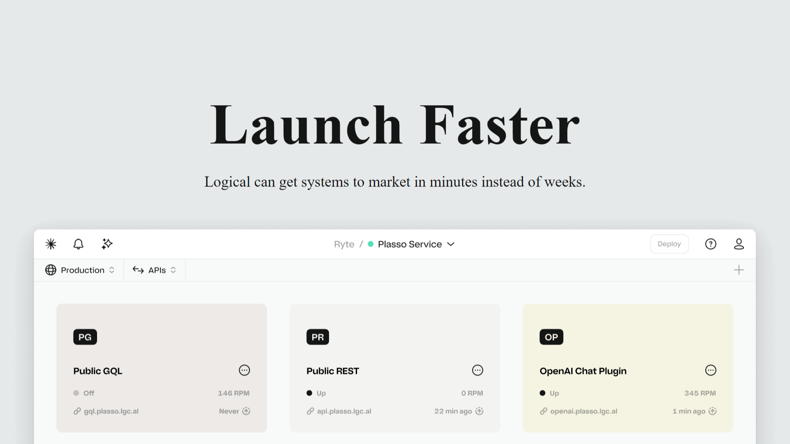

<div align="center">
    <a href="https://scroll-animation-fv.netlify.app/" target="_blank">
      
    </a>
  <h3 align="center">Scroll Animation - JS</h3>
</div>

##  <br /> 📋 <a name="table">Table of Contents</a>

- ✨ [Introduction](#introduction)
- ⚙️ [Tech Stack](#tech-stack)
- 🚀 [Quick Start](#quick-start)

##  <br /> <a name="introduction">✨ Introduction</a>

**[EN]** Landing page featuring a modern scroll animation, built using only HTML, CSS, and JavaScript, without any libraries. This design incorporates smooth, engaging animations triggered by scrolling, enhancing user interaction and visual appeal with a clean and contemporary aesthetic.

**[FR]** Page d'accueil avec des animations modernes au défilement, réalisées uniquement en HTML, CSS et JavaScrip, sans utilisation de bibliothèque. Ce design offre des animations fluides et captivantes qui se déclenchent lors du défilement, optimisant l'interaction utilisateur et l'attrait visuel avec une esthétique moderne et épurée.

##  <br /> <a name="tech-stack">⚙️ Tech Stack</a>

- **HTML** (HyperText Markup Language) is the standard markup language used to create and structure content on the web. It provides the basic building blocks for web pages, defining elements such as headings, paragraphs, images, links, and more. HTML forms the backbone of any web document and is essential for web development.
  
- **CSS** (Cascading Style Sheets) is a stylesheet language used to control the presentation and layout of web pages. It allows developers to apply styles such as colors, fonts, spacing, and positioning to HTML elements. CSS enhances the visual appeal and user experience of a website by enabling the separation of content and design.
  
- **JavaScript** is a versatile programming language that enables interactive and dynamic functionality on web pages. It allows developers to create features like form validation, animations, and asynchronous content loading. JavaScript is essential for building modern web applications and works seamlessly with HTML and CSS to create a complete user experience.


## <br /> <a name="quick-start">🚀 Quick Start</a>

Follow these steps to set up the project locally on your machine.

<br/>**Prerequisites**

Make sure you have the following installed on your machine:

- [Git](https://git-scm.com/)
- [Node.js](https://nodejs.org/en)
- [npm](https://www.npmjs.com/) (Node Package Manager)

<br/>**Cloning the Repository**

```bash
git clone {git remote URL}
```

<br/>**Running the Project**

Use [Live Server](https://marketplace.visualstudio.com/items?itemName=ritwickdey.LiveServer)
to launch a development local server with live reload feature for static & dynamic pages.****